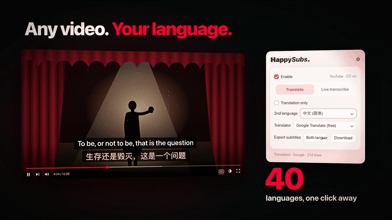
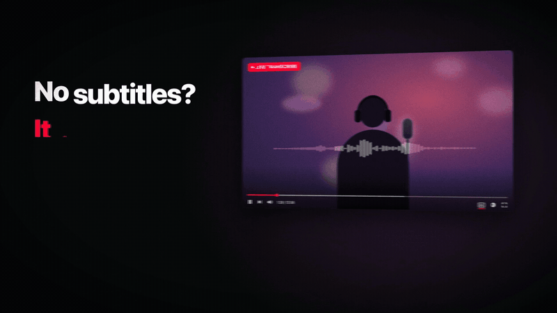

# HappySubs — YouTube / Vimeo / B站 双语字幕

[](https://chromewebstore.google.com/detail/malocefbdblplamcmmmpilepcgllfmnf?utm_source=github&utm_medium=readme) [](https://chromewebstore.google.com/detail/malocefbdblplamcmmmpilepcgllfmnf?utm_source=github&utm_medium=readme) [](https://chromewebstore.google.com/detail/malocefbdblplamcmmmpilepcgllfmnf?utm_source=github&utm_medium=readme) [](LICENSE)

> 在 **YouTube**、**Vimeo**、**B站** 上同时显示两种语言的字幕；没有字幕的视频还能**实时听译**。使用自带字幕或 Google 免费翻译，也可以用 Claude / OpenAI / Gemini / DeepSeek 翻译。



<sub>动图截自 30 秒介绍片，完整版在[项目主页](https://huanshuowang.com/happysubs/)。</sub>

- **📖 项目主页：** https://huanshuowang.com/happysubs/
- **🎙️ 实时听译安装说明：** https://huanshuowang.com/happysubs/#live
- **🔒 隐私政策：** https://huanshuowang.github.io/happysubs/privacy.html

---

## ✨ 特点

- **🪶 双语合成一条字幕**：原文和译文两行一起出现、一起换，一句一次；自动生成字幕也不再逐字滚动，换成整理好的整句
- **⚡ 零延迟同步**：拿到整条字幕轨后提前翻译，跟视频时间轴精确对齐
- **🎯 整句翻译**：合并 ASR 把一句话切成两半的碎片再翻译，比同类扩展效果更好
- **🎬 三个平台**：YouTube、Vimeo（含嵌在别处的播放器）、B站
- **🎙️ 实时听译**：给完全没有字幕的视频用（B站上很常见）。抓视频音频，边播边转字幕再翻译。识别在你自己电脑上跑，**音频不出本机**，也没有按分钟计费
- **👁️ 仅翻译模式**：默认跟随播放器——不开原生字幕就不显示翻译。想只看译文的话，在插件弹窗里打开「仅显示翻译字幕」，关着 CC 也能单独显示第二语言
- **🖱️ 悬停拖动字幕位置**：鼠标碰到字幕就浮出拖拽把手，全屏也能调
- **⬇️ 导出字幕**：把正在看的字幕存成 .srt，可选双语、仅原文或仅译文，文件名带视频名、频道名和语言
- **⌨️ 一键开关**：Mac 上 ⌘⇧S，Windows / Linux 上 Alt+Shift+S，不用打开弹窗就能在原文和双语之间切换
- **🌍 100+ 种语言**：Google Translate 支持的目标语言都能选
- **🔐 免费可用 · AI 增强可选**：使用视频自带字幕或 Google 免费翻译。需要更高精度时，可选 Claude / OpenAI / Gemini / DeepSeek 增强翻译，可以挑具体模型或自己填模型名，翻译进度显示在视频上方；付费 API 怎么调用由你定（每次询问 / 总是使用 / 只在点按钮时）
- **🎨 样式可调**：字号、颜色、背景透明度、垂直位置随你调，**原文和译文可以分开设置**，也能锁成同一套；另有**字幕宽度**百分比，在没有原生字幕可对齐时（实时听译、仅翻译模式）生效——画面左右有黑边时调小，字幕就只落在画面里
- **⚙️ 设置**：弹窗右上角的齿轮里，是字幕外观和面板语言（跟随浏览器 / 中文 / English）

## 📦 安装

**从 Chrome 应用商店安装**（推荐）：[HappySubs](https://chromewebstore.google.com/detail/malocefbdblplamcmmmpilepcgllfmnf?utm_source=github&utm_medium=readme)

想从源码装的话：clone 本仓库 → `chrome://extensions` 开启 **Developer mode** → **Load unpacked** 选仓库根目录。

装好之后：

1. **打开视频** — YouTube 上先点 CC 按钮开原生字幕（选你想看的第一种语言）；Vimeo 和 B站 上不用
2. **点扩展图标** — 选第二语言即可

## 🎬 使用

- **YouTube**：必须先点播放器右下角的 **CC** 打开原生字幕，扩展才拿得到字幕
- **Vimeo**：不需要先开 CC——扩展会直接读字幕轨。想同时看到原文再点 CC 就行
- 打开后中文（或你选的语言）会自动叠加在原生字幕上方
- 只想看译文、不想看原文？弹窗里勾上 **仅显示翻译字幕**，之后不开 CC 也会显示
  - YouTube 上扩展会自己向播放器要一次字幕轨（`loadModule` + 切轨 + `unloadModule`），取完把 CC 还原成关着的状态，全程有遮挡不会闪
  - 万一没取到，弹窗会提示你：在播放器里点一下 CC 再关掉即可。扩展会留着这份字幕，之后单独显示译文
- 如果选择 Claude / OpenAI / Gemini / DeepSeek，需要先填写 API Key，然后点击 **本视频使用所选 API 翻译** 才会调用
- 鼠标碰字幕 → 上方浮出 ↕ 小方块 → 按住拖动调位置
- 弹窗首页：开关、第二语言、翻译源、API Key、字幕样式、导出字幕；字号、颜色、背景透明度、垂直位置在右上角齿轮里
- ⌘⇧S（Windows / Linux 上 Alt+Shift+S）随时开关第二语言

## 🔧 工作原理

平台相关的代码全在 `platform.js` 里，`content.js` 只做与平台无关的事：合并碎句、五个翻译源、付费 API 确认、叠加层渲染与拖拽。适配器只需要回答四个问题——`<video>` 在哪、叠加层挂在哪、有哪些字幕轨、把某条轨的 cue 给我。

YouTube 和 Vimeo 拿字幕的方式正好相反，B站 又是第三种：

**YouTube（被动拦截）**

1. `inject-youtube.js` 在页面主 world 里 hook 掉 `window.fetch` / `XMLHttpRequest`
2. YouTube 播放器请求 `/api/timedtext` 时截获响应（JSON3 或 SRV3 格式）
3. 想读另一种语言，得让播放器自己切一次轨再截获

之所以要绕这一圈，是因为 YouTube 对第三方直接请求 timedtext API 返回空 body（PoT token 校验）——只有播放器自己带的请求能成功。

**Vimeo（主动抓取）**

1. 字幕轨就是普通的 `<track>` 元素，指向 `captions.vimeo.com/captions/{id}.vtt`（带 `expires` + `sig` 签名）
2. 这些 `.vtt` 允许跨源读取，直接 `fetch` 解析成 cue，不需要 hook，也不需要用户先开 CC
3. `inject-vimeo.js` 额外读一份 `playerConfig.request.text_tracks`——那是全量轨道列表（只在 `player.vimeo.com` 上有）
4. 万一签名过期，退回到 `video.textTracks`，让浏览器自己解析

**B站（走自家 API）**

1. 用视频的 `bvid` 请求 `api.bilibili.com/x/web-interface/view`，拿到这一 P 的 `cid`
2. 再请求 `api.bilibili.com/x/player/v2`，得到字幕轨列表和每条轨的字幕文件地址；`ai-` 开头的是 AI 生成字幕，人工字幕优先
3. B站 只对登录用户返回字幕列表——没登录时会显示"没有字幕"，真没有字幕的视频就用下面的实时听译

拿到 cue 之后三个平台走同一条路：合并被切碎的句子 → 整片批量翻译 → 用 `requestAnimationFrame` 跟着 `video.currentTime` 渲染到叠加层。

## 🎙️ 实时听译

给没有字幕轨的视频用。扩展抓取播放器音频送到**本地识别服务**，识别结果实时叠在画面上（上行原文、下行译文）。



三个平台都能用（音频抓取在 YouTube 上实测可行），但主要是给 B站——那里大部分视频没有字幕轨。

字幕轨比识别准，所以扩展**不会自己**切到听译。但你手动开启听译时它就接管画面，即使这个视频有字幕轨——你按了按钮就该看到东西。关掉听译，字幕轨立刻回来。

### 装本地识别服务

需要系统有 python3。一条命令，**不用 clone 仓库**：

```bash
curl -fsSL https://raw.githubusercontent.com/huanshuowang/happysubs/main/setup.sh | bash
```

脚本会在当前位置建一个 `happysubs-server/` 文件夹，装好 Python 虚拟环境，并从 [sherpa-onnx 官方 release](https://github.com/k2-fsa/sherpa-onnx/releases/tag/asr-models) 下载中英双语流式模型（约 500MB 压缩包，解压后保留 193MB）。装好后启动：

```bash
cd happysubs-server && .venv/bin/python server.py
```

已经 clone 了整个仓库的话，在仓库根目录跑 `./setup.sh` 效果一样，服务会装在 `server/` 里。

看到 `监听 ws://127.0.0.1:8765` 就绪。然后在插件弹窗切到「实时听译」标签，点开启。

模型和虚拟环境都不进 git——服务端源码一共 16KB（`server.py` + `requirements.txt` + `setup.sh`），那 193MB 模型是安装时从 sherpa-onnx 官方 release 下的，不占本项目的仓库和带宽。

### 注意

- 要**先点一下播放**，浏览器才允许处理音频
- 暂停视频后字幕会**保留 8 秒**再淡出，够你读完再走。字幕轨模式下不受影响——时间轴停了，那句字幕本来就一直在
- 服务端一次只服务一个页面，同时开多个标签页会互相干扰
- 听译的译文固定走 Google 免费翻译，不走付费 API——识别中的句子每秒会重译一次，把这个计费到 LLM 上会是笔意外账单。付费 API 用在字幕轨翻译上（一次性、句数固定）
- 端口被占用：`lsof -ti:8765 | xargs kill` 后重启

## 🈯 翻译来源怎么选的

- 跟随你在播放器里选的那条字幕轨。中途换一条（比如泰语换成英语），译文会自动按新原文重新翻，不会停在旧的那份上
- 如果播放器给的是**自动生成**字幕，而这个视频同时有**同语言的人工字幕**，扩展会改用人工那条来翻译——只在同一语言内替换，所以原文字幕条和译文说的仍是同一件事，你只会感觉译文更准
- 升级之后不会再退回去：播放器把你原来选的自动生成轨重新取一遍，也不会把来源拉回机器转写
- 仅翻译模式下（CC 关着）没有"你选的那条"，优先级是：**原语言人工轨 > 其他语言人工轨 > 机器转写**
  - 举例：一个泰语视频只有「泰语自动生成 + 英语人工」，会用英语人工轨翻译（转译一道，但人工文本比机器转写可靠）；如果还有一条泰语人工轨，就直接用它，不转译
  - 视频原语言是从机器转写轨的语言判断的——播放器只会为实际说话的语言自动生成字幕

## 🔐 权限

每一条 host permission 都对应代码里真实发生的事，没有"以防万一"的：

- `www.youtube.com` / `vimeo.com` / `player.vimeo.com` / `www.bilibili.com` —— 扩展运行的页面
- `captions.vimeo.com` / `api.bilibili.com` —— 这两个站放字幕文件的地方，要 fetch
- 五个翻译服务域名 —— 只在你选中某一家时才会请求它

不申请 `tabs`（弹窗只要当前标签页 URL，上面的 host permission 已经够），也不申请 `scripting`（脚本全部通过 manifest 静态声明注入）。

实时听译不需要任何 host permission——它连的是本机 `127.0.0.1`。

## ⚠️ 已知限制

- Vimeo 播放器的类名是构建哈希（`Captions_module_captions__5ed5b89b`），代码只依赖 `.vp-video-wrapper`、`.vp-captions`、`#cc-control-bar-button` 这些稳定名字，Vimeo 改版可能需要跟进
- 在 `vimeo.com` 观看页上拿不到 `playerConfig`，多语言轨道只能靠 DOM 里的 `<track>` 元素枚举；`player.vimeo.com`（含嵌入播放器）能拿到全量列表
- `.vtt` 的签名 URL 有有效期，扩展只在打开视频时取一次
- 默认模式下，如果实在读不出播放器的字幕开关状态（站点改版、或没有控制条的嵌入播放器且没有字幕轨），叠加层会选择**不显示**——宁可不显示，也不要在用户没要求时凭空放一行字幕上去。这种情况下勾上「仅显示翻译字幕」即可

## 🧪 测试

`test/` 下是一组跑在浏览器里的测试页，不需要装扩展也不需要 node：

```bash
python3 -m http.server 8794
```

详见 [test/README.md](test/README.md)。

## 📝 更新日志

### 2.1.2

- 换句时字幕不再闪一下，暂停时也不再压住控制栏
- 新装的用户会先看到一页上手说明

### 2.1.1

- 修好了付费 AI 翻译不弹确认、换翻译源后按钮失灵的问题
- 翻译源的报错改成了一句看得懂的话

### 2.1.0

- **双语合成一条字幕**：两行一起出现、一起换，一句一次；自动生成字幕不再逐字滚动，换成整理好的整句
- 原文和译文的字号、颜色、背景透明度可以分开调，也能一个开关锁成同一套
- 新增 .srt 导出（双语 / 仅原文 / 仅译文）和 ⌘⇧S（Windows / Linux 上 Alt+Shift+S）快捷开关
- 界面重新设计；设置分了主次，常用的留在弹窗首页，字幕外观和面板语言在齿轮里，单独的设置页取消
- AI 翻译可以选模型或自己填；翻译进度显示在视频上方
- 付费 API 的调用方式三选一：每次询问、总是使用、只在点按钮时
- 修复：开头有贴片广告的视频没有字幕等问题

### 2.0.1

- 长视频后半段不再只剩原文：免费翻译被限流时自己放慢而不是直接断掉，真翻不出来会在字幕上说一声

### 2.0.0

- 合并 Bili Live Caption：新增 **B站** 支持和**实时听译**
- B站 走自家 API 拉字幕轨，因此白拿了四个翻译源、人工轨优先、译文宽度对齐等全部能力（原本只有 Google 翻译）
- 弹窗顶部分「直接翻译 / 实时听译」两个标签页，字幕样式两边共用
- 听译在三个平台都可用；手动开启后即使视频有字幕轨也会接管画面，关掉即还原
- 听译的字幕层完全沿用 Bili Live Caption 的排版：宽度固定不随文字跳动、高度锁定两行、旧行从顶部滚出、背景贴合每行文字、淡入淡出
- 从 Bili Live Caption 保留了「字幕宽度」百分比设置，用在没有原文可对齐的场景
- 本地识别服务（`server/`）随仓库分发，`setup.sh` 一条命令装好
- 修复：从列表页点进视频时扩展不工作。这三个站都是 SPA，原来在列表页判定"没有视频"后就永久放弃了，现在会在导航到视频时接上（B站 和 Vimeo 都受此影响）
- B站 的番剧、festival、合集页面现在也认得出来

### 1.4.0

- 新增 Vimeo 支持：`vimeo.com` 观看页、`player.vimeo.com` 播放器、以及嵌在第三方站点里的 Vimeo 播放器
- 平台相关逻辑抽成 `platform.js` 适配器，`content.js` 变成平台无关
- Vimeo 上不再要求先打开 CC——直接读字幕轨
- 新增设置页（`chrome://extensions` → 详细信息 → 扩展程序选项）：可以把面板语言固定成中文或英文，不再只能跟随浏览器
- 新增「仅显示翻译字幕」开关：默认不开原生字幕就看不到译文（跟播放器保持一致），打开后可单独显示第二语言
- 译文行宽会向原文字幕行宽对齐，不再出现原文一行、译文折成两三行
- 修复：拖动把手在 Vimeo 上不出现，也拖不动（`.vp-target` 覆盖层挡住了鼠标事件）
- 修复：切换目标语言时，之前当作原文读过的那条轨可以被重新读成目标语言

### 1.2.0

- 支持 Claude / OpenAI / Gemini / DeepSeek 翻译源
- 优先使用视频自带目标语言字幕；没有 native track 时默认使用 Google 免费翻译
- 付费 API 默认不会自动调用，需要在插件弹窗中手动确认当前视频使用
- 可选择开启“每次打开视频自动询问是否使用付费 API”
- 弹窗显示当前实际翻译源和实时翻译进度
- API Key 默认锁定显示，右侧显示保存状态，可点击编辑

## 🐛 反馈 / 贡献

- Bug 或需求 → [提 Issue](https://github.com/huanshuowang/happysubs/issues)
- 想加功能 → 欢迎 PR

## 📄 License

MIT
